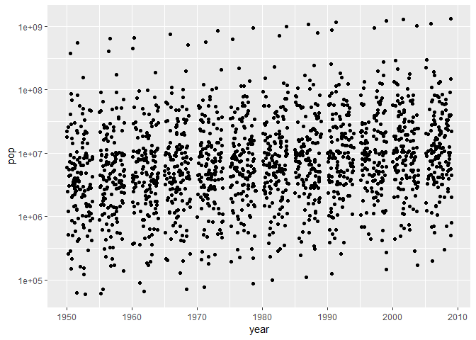
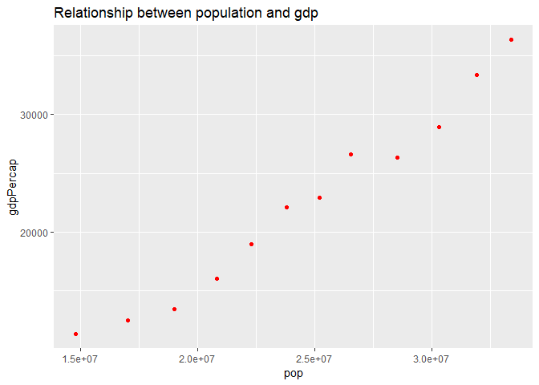

STAT 545A Homework 2
================
Tian Gao
2018/9/20

# Bring rectangular data in

``` r
library(tidyverse)
```

    ## -- Attaching packages ------------------------------------- tidyverse 1.2.1 --

    ## √ ggplot2 3.0.0     √ purrr   0.2.5
    ## √ tibble  1.4.2     √ dplyr   0.7.6
    ## √ tidyr   0.8.1     √ stringr 1.3.1
    ## √ readr   1.1.1     √ forcats 0.3.0

    ## -- Conflicts ---------------------------------------- tidyverse_conflicts() --
    ## x dplyr::filter() masks stats::filter()
    ## x dplyr::lag()    masks stats::lag()

``` r
library(gapminder)
```

# Smell test the data

## Is it a data frame, a matrix, a vector, a list?

``` r
class(gapminder)
```

    ## [1] "tbl_df"     "tbl"        "data.frame"

``` r
is.data.frame(gapminder)
```

    ## [1] TRUE

``` r
is.list(gapminder)
```

    ## [1] TRUE

  - This is a data frame

## what is its class?

  - Its classes are tbl\_df, tbl,
data.frame

## How many variables/columns?

``` r
ncol(gapminder)
```

    ## [1] 6

## How many rows/observations?

``` r
nrow(gapminder)
```

    ## [1] 1704

## Can you get these facts about “extent” or “size” in more than one way? Can you imagine different functions being useful in different contexts?

``` r
dim(gapminder)
```

    ## [1] 1704    6

## What data type is each variable?

``` r
str(gapminder)
```

    ## Classes 'tbl_df', 'tbl' and 'data.frame':    1704 obs. of  6 variables:
    ##  $ country  : Factor w/ 142 levels "Afghanistan",..: 1 1 1 1 1 1 1 1 1 1 ...
    ##  $ continent: Factor w/ 5 levels "Africa","Americas",..: 3 3 3 3 3 3 3 3 3 3 ...
    ##  $ year     : int  1952 1957 1962 1967 1972 1977 1982 1987 1992 1997 ...
    ##  $ lifeExp  : num  28.8 30.3 32 34 36.1 ...
    ##  $ pop      : int  8425333 9240934 10267083 11537966 13079460 14880372 12881816 13867957 16317921 22227415 ...
    ##  $ gdpPercap: num  779 821 853 836 740 ...

  - We can see that there are six variables:
  - “country” is Factor
  - “continent” is Factor
  - “year” is int
  - “lifeExp” is num
  - “pop” is int
  - “gdpPercap” is num

# Explore individual variables

## What are possible values of each variables?

``` r
unique(gapminder$year)
```

    ##  [1] 1952 1957 1962 1967 1972 1977 1982 1987 1992 1997 2002 2007

``` r
range(gapminder$year)
```

    ## [1] 1952 2007

  - Above are the unique values and range of “year” variable

<!-- end list -->

``` r
unique(gapminder$continent)
```

    ## [1] Asia     Europe   Africa   Americas Oceania 
    ## Levels: Africa Americas Asia Europe Oceania

  - Above are the unique values of “continent” variable.

## What values are typical? What’s the spread? What’s the distribution?

``` r
frequency_year = table(gapminder$year)
frequency_continent = table(gapminder$continent)
frequency_year
```

    ## 
    ## 1952 1957 1962 1967 1972 1977 1982 1987 1992 1997 2002 2007 
    ##  142  142  142  142  142  142  142  142  142  142  142  142

``` r
frequency_continent
```

    ## 
    ##   Africa Americas     Asia   Europe  Oceania 
    ##      624      300      396      360       24

  - We can see that, from the aspect of year, the sample is equally
    distributed, every year appeard 142 times
  - From the aspect of continent, the typical value is “Africa”

<!-- end list -->

``` r
summary(gapminder$year)
```

    ##    Min. 1st Qu.  Median    Mean 3rd Qu.    Max. 
    ##    1952    1966    1980    1980    1993    2007

``` r
summary(gapminder$continent)
```

    ##   Africa Americas     Asia   Europe  Oceania 
    ##      624      300      396      360       24

# Explore various plot types

## Make a few plots, probably of the same variable you chose to characterize numerically. You can use the plot types we went over in class (cm006) to get an idea of what you’d like to make. Try to explore more than one plot type.

  - First I’ll explore the year and LifeExp

<!-- end list -->

``` r
# year as x axis and lifeExp as y axis
ggplot(gapminder,aes(x=year, y=lifeExp))+
  # scale y axis by log10
  scale_y_log10()+
  # make a scatterplot
  geom_point()
```

<!-- -->

  - Here is the jitter version

<!-- end list -->

``` r
ggplot(gapminder, aes(x=year, y=pop))+
  scale_y_log10()+
  # make a jitter plot
  geom_jitter()
```

<!-- --> \*
Next I want to check the relation between population and GDPpercap.

``` r
gapminder %>%
  # filter the country
  filter(country == 'Canada') %>%
  ggplot(aes(pop, gdpPercap)) +
  geom_point(alpha = 1,colour = "red") +
  ggtitle("Relationship between year and gdp")
```

<!-- --> \*
If we want to see all relations between any two of the variables, we can
use pairs

``` r
pairs(gapminder)
```

<!-- -->

  - Next I’ll focus on canada and plot the changes in canadian’s lifeExp
    against year.

<!-- end list -->

``` r
# filter the country to see only Canada
  filter(gapminder, country == "Canada") %>%
  ggplot(aes(x=year, y=lifeExp))+
  scale_y_log10()+
# plot both point and line to see the trend
  geom_point()+
  geom_line()
```

<!-- -->

  - Next I’ll plot the histgram, densityplot and frequency polygon of
    population
  - A histogram of “pop”

<!-- end list -->

``` r
ggplot(gapminder, aes(x=pop)) + 
  geom_histogram(bins=100)+
  scale_x_log10()
```

<!-- -->

  - A densityplot of “pop”

<!-- end list -->

``` r
ggplot(gapminder, aes(x = pop))+
  geom_density(fill="pink")+
  scale_x_log10()
```

<!-- -->

  - I’ll then plot both of the histogram and densityplot in one graph.

<!-- end list -->

``` r
ggplot(gapminder, aes(x=pop)) + 
  scale_x_log10()+
  geom_histogram(bins=100, aes(y=..density..))+
  geom_density()
```

<!-- -->

  - A frequency polygon of “pop”

<!-- end list -->

``` r
ggplot(gapminder, aes(x = pop))+
  scale_x_log10()+
  geom_freqpoly(bins=100)
```

<!-- -->

  - Next I’ll use boxplots to show the population of different
    continents

<!-- end list -->

``` r
# select population and continent
select(gapminder, pop, continent) %>%
  ggplot(aes(x = continent, y=pop)) + 
  scale_y_log10()+
# make a boxplot
  geom_boxplot()
```

<!-- -->

# But I want to do more

## Evaluate this code and describe the result

``` r
filter(gapminder, country == c("Rwanda", "Afghanistan"))
```

    ## # A tibble: 12 x 6
    ##    country     continent  year lifeExp      pop gdpPercap
    ##    <fct>       <fct>     <int>   <dbl>    <int>     <dbl>
    ##  1 Afghanistan Asia       1957    30.3  9240934      821.
    ##  2 Afghanistan Asia       1967    34.0 11537966      836.
    ##  3 Afghanistan Asia       1977    38.4 14880372      786.
    ##  4 Afghanistan Asia       1987    40.8 13867957      852.
    ##  5 Afghanistan Asia       1997    41.8 22227415      635.
    ##  6 Afghanistan Asia       2007    43.8 31889923      975.
    ##  7 Rwanda      Africa     1952    40    2534927      493.
    ##  8 Rwanda      Africa     1962    43    3051242      597.
    ##  9 Rwanda      Africa     1972    44.6  3992121      591.
    ## 10 Rwanda      Africa     1982    46.2  5507565      882.
    ## 11 Rwanda      Africa     1992    23.6  7290203      737.
    ## 12 Rwanda      Africa     2002    43.4  7852401      786.

  - Evaluate this code and describe the result. Presumably the analyst’s
    intent was to get the data for Rwanda and Afghanistan. Did they
    succeed? Why or why not? If not, what is the correct way to do this?
  - I think we should use %in% instead of ==, because the original
    intent is to get data either of Afghanistan or Rwanda. The following
    is the right version.
  - Another way to do this is to use ||.

<!-- end list -->

``` r
filter(gapminder, country %in% c("Rwanda", "Afghanistan"))
```

    ## # A tibble: 24 x 6
    ##    country     continent  year lifeExp      pop gdpPercap
    ##    <fct>       <fct>     <int>   <dbl>    <int>     <dbl>
    ##  1 Afghanistan Asia       1952    28.8  8425333      779.
    ##  2 Afghanistan Asia       1957    30.3  9240934      821.
    ##  3 Afghanistan Asia       1962    32.0 10267083      853.
    ##  4 Afghanistan Asia       1967    34.0 11537966      836.
    ##  5 Afghanistan Asia       1972    36.1 13079460      740.
    ##  6 Afghanistan Asia       1977    38.4 14880372      786.
    ##  7 Afghanistan Asia       1982    39.9 12881816      978.
    ##  8 Afghanistan Asia       1987    40.8 13867957      852.
    ##  9 Afghanistan Asia       1992    41.7 16317921      649.
    ## 10 Afghanistan Asia       1997    41.8 22227415      635.
    ## # ... with 14 more rows

``` r
gapminder %>%
  filter(country == "Rwanda" | country == "Afghanistan")
```

    ## # A tibble: 24 x 6
    ##    country     continent  year lifeExp      pop gdpPercap
    ##    <fct>       <fct>     <int>   <dbl>    <int>     <dbl>
    ##  1 Afghanistan Asia       1952    28.8  8425333      779.
    ##  2 Afghanistan Asia       1957    30.3  9240934      821.
    ##  3 Afghanistan Asia       1962    32.0 10267083      853.
    ##  4 Afghanistan Asia       1967    34.0 11537966      836.
    ##  5 Afghanistan Asia       1972    36.1 13079460      740.
    ##  6 Afghanistan Asia       1977    38.4 14880372      786.
    ##  7 Afghanistan Asia       1982    39.9 12881816      978.
    ##  8 Afghanistan Asia       1987    40.8 13867957      852.
    ##  9 Afghanistan Asia       1992    41.7 16317921      649.
    ## 10 Afghanistan Asia       1997    41.8 22227415      635.
    ## # ... with 14 more rows

  - Explore summarise() and group\_by()

<!-- end list -->

``` r
group_by(gapminder, continent) %>%
summarize(
    avg_lifeExp = mean(lifeExp),
    average_gpd = mean(gdpPercap),
  
)
```

    ## # A tibble: 5 x 3
    ##   continent avg_lifeExp average_gpd
    ##   <fct>           <dbl>       <dbl>
    ## 1 Africa           48.9       2194.
    ## 2 Americas         64.7       7136.
    ## 3 Asia             60.1       7902.
    ## 4 Europe           71.9      14469.
    ## 5 Oceania          74.3      18622.
